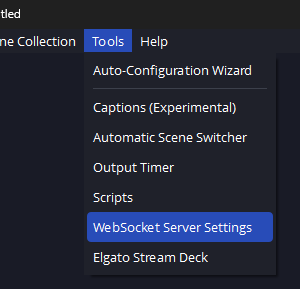

## getting started

To get started, make sure you're running the latest OBS version so the [WebSocket Server](https://github.com/obsproject/obs-websocket) is already included alongside it.

If you don't see settings for the server under the _Tools_ menu like in the following screenshot, you're likely on a very old version and it's highly recommended to upgrade.



For older distributions, it's still possible to run the Websocket server as a plugin, but chances are the server's protocol will be v4 and unusable with this library.
Please see [obsproject/obs-websocket](https://github.com/obsproject/obs-websocket) for more details on that.
The last `goobs` release to support v4 was [v0.8.1](https://github.com/andreykaipov/goobs/releases/tag/v0.8.1), so the following documentation doesn't apply and you'll be in for a rough ride!

## connecting

From the server settings, confirm the server is enabled:


And connect!

```go
        client, err := goobs.New("localhost:4455", goobs.WithPassword("bigmoney420!!"))
```

Note for Windows users: if your development environment is within WSL, but OBS is running on the Windows host, you'll have to point the address to the Windows host instead, i.e. `ip route show default | awk '{print $3}'`.

The `goobs.WithPassword(...)` is an option we can pass to `goobs.New(...)` to configure the client.
Check the [Go docs](https://pkg.go.dev/github.com/andreykaipov/goobs#Option) for all the other possible options.

## making requests

The [OBS websocket protocol](https://github.com/obsproject/obs-websocket/blob/master/docs/generated/protocol.md) is pretty exhaustive, and it's recommended to look through the requests and events there to see if any spark any ideas.
To help figure out how to perform a certain request with this library, a mapping between requests in the protocol to corresponding `goobs` requests is available at [request-mapping.md](/docs/request-mapping.md).

This client library is in fact [generated from the same protocol documentation](/internal/generate/protocol/main.go), so using `goobs` should hopefully remain fairly consistent with what you see in the protocol with little surprises.
If some field type between requests or responses seem off though, please open up an issue!

### example

For example, consider the [CreateInput](https://github.com/obsproject/obs-websocket/blob/master/docs/generated/protocol.md#createinput) request under the _Inputs_ category.
The following will add a new video capture input as a source into our specified scene:

```go
        params := inputs.NewCreateInputParams().
                WithSceneName("my scene").
                WithInputName("new browser").
                WithInputKind("dshow_input")
        resp, err := client.Inputs.CreateInput(params)
```

This is one way to pass parameters, but we could also create the `&inputs.CreateInputParams{}` struct directly:

```go
        sceneName := "my scene"
        inputName := "new browser"
        inputKind := "dshow_input"
        resp, err := client.Inputs.CreateInput(&inputs.CreateInputParams{
                SceneName: &sceneName,
                InputName: &inputName,
                InputKind: &inputKind,
        })
```

### finding info

Wait a minute... how did you know to use `dshow_input`?

Trial and error!

For example, we could use `client.Inputs.GetInputList()` to iterate over all the inputs to view the various "input kinds" of our existing inputs to narrow it down:

```go
        resp, _ := client.Inputs.GetInputList()
        for _, i := range resp.Inputs {
                fmt.Printf("%+v\n", i)
        }
```

We can also subscribe to the server events, interact with OBS, and see what gets printed out, hoping it has the info we're looking for:

```go
        client.Listen(func(event any) {
                fmt.Printf("got event: %#v\n", event)
        })
```

If we interact with OBS while the above is running, and create a new video capture input, we'll find the following event in our logs:

```
got event: &events.InputCreated{DefaultInputSettings:map[string]interface {}{"active":true, "audio_output_mode":0, "autorotation":true, "color_range":"default", "color_space":"default", "frame_interval":-1, "hw_decode":false, "res_type":0, "video_format":0}, InputKind:"dshow_input", InputName:"Video Capture Device 4", InputSettings:map[string]interface {}{}, UnversionedInputKind:"dshow_input"}
```

And in that blob of JSON, we'll find `InputKind:"dshow_input"`!

Alternatively, we can also read from the `client.IncomingEvents` channel directly and use type assertion to filter through events:

```go
        for _, event := range c.IncomingEvents {
                switch e := event.(type) {
                case *events.SceneItemListReindexed:
                        // event i wanted
                default:
                        // unhandled event
                }
        }
```

### accessing the raw response

If you find the generated API to be incorrect, and the response for a request is missing documented fields in the Go struct, accessing the "raw" response from the server is possible, so that you can perform the necessary JSON unmarshalling yourself:

```go
        resp, _ := client.Inputs.GetInputList()
        data := map[string]any{}
        if err := json.Unmarshal(resp.GetRaw(), &data); err != nil {
                panic(err)
        }
        fmt.Println(data["inputs"])
```

If you find yourself having to use this though, please open up an issue!

## advanced configuration

- `GOOBS_LOG` can be set to one of `trace`, `debug`, `info`, or `error` to better understand what our client is doing under the hood.

- `GOOBS_PROFILE` can be set to enable profiling.
  For example, the following will help us find unreleased memory:

  ```console
  ❯ GOOBS_PROFILE=memprofile=mem.out OBS_PORT=4455 go test -v -run=profile client_test.go
  ❯ go tool pprof -top -sample_index=inuse_space mem.out
  ```

  Set `GOOBS_PROFILE=help` to see all the other available options.
